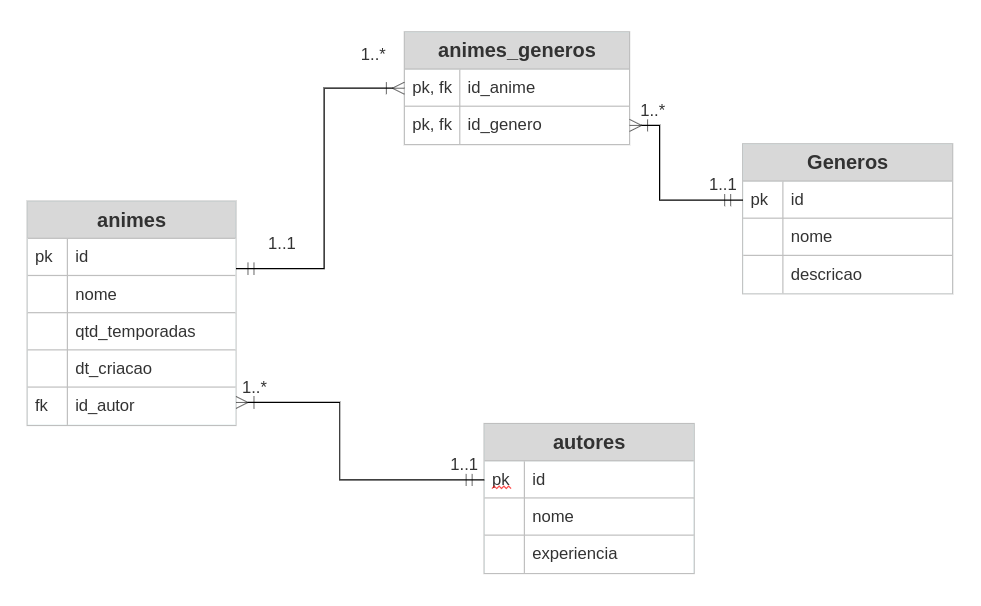

# :jp: API Loja Animes


API Rest que gerencia recursos "anime", "autor" e "genero". Através dela pode-se realizar CRUD nos recursos e obter relátorios como generos por autor, etc. Os dados são armazenados no banco de dados relacional Postgres.

São realizadas verificações para impedir que um anime de mesmo nome seja cadastrado, que um relacionamento entre anime e genero seja cadastrado mais de uma vez e outros.

Modelei o seguinte diagrama entidade-relacionamento para o projeto:



A API está hospedada no Heroku. Veja a documentação abaixo para mais detalhes de como utilizar a API.

## :electric_plug: Técnicas e tecnologias utilizadas

| Tech         | Badge                                                                                                                       |
|--------------|-----------------------------------------------------------------------------------------------------------------------------|
| Java 11      |                       |
| Apache Maven |  |
| Spring Boot  |                 |
| Postgres     |         |
| Postman      |                     |
| Heroku       |                 |
|              |                                                                                                                             |

## :hammer_and_wrench: Instalção

Foi escolhida para desenvolvimento e testes a plataforma [Spring Tool Suite](https://spring.io/tools). Para executar o projeto, recomendo o uso da mesma.

Para testar e realizar requisições utilizou-se [Postman](https://www.postman.com/downloads/)

O banco utilizado no projeto foi [Postgres](https://www.postgresql.org/download/)

1. Download e configuração da Spring Tool Suite
2. Download e configuração do Postgres
3. Download e configuração do Postman
4. Realizar clone do projeto

```shell
git clone https://github.com/emeath/loja-anime.git
```

5. Configurar usuário e senha (postgres, postgres) (*O usuário e senha padrão utilizados nesse projeto para conexão com o banco são postgres e postgres respectivamente. Sinta-se livre para alterar esses dados em **src/main/resources/application.properties***)
6. Criar tabela no banco de dados Postgres com nome **loja_animes**
7. Alterar a url base informada na documentção abaixo, de: https://apirest-loja-animes.herokuapp.com para: **http://localhost:8080**

### Spring Tool Suite

- Importar projeto existente Maven
- No *Boot Dashboard* clicar em *Start or restart the process associated with the selected elements* 

### Postman

Por favor, veja a documentação da API clicando no botão abaixo: 

[](https://documenter.getpostman.com/view/17453534/VUjPJ5ac)


